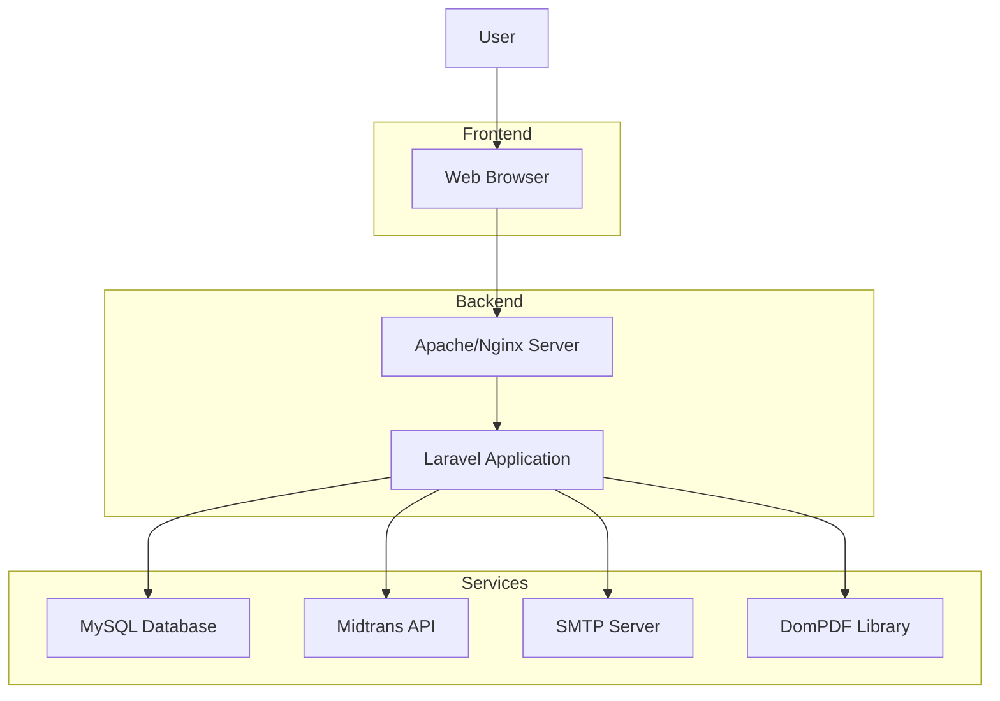
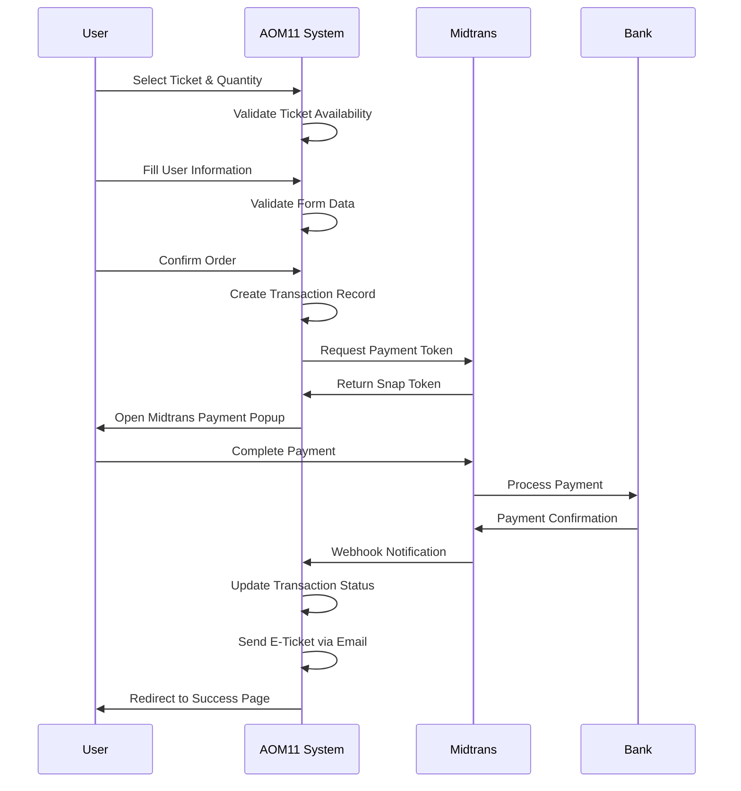

# Art of Manunggalan 11.0 (AOM11)

A comprehensive ticketing system for the Art of Manunggalan 11.0 event, built with Laravel and integrated with Midtrans payment gateway.

## Table of Contents

-   [Overview](#overview)
-   [Features](#features)
-   [Technology Stack](#technology-stack)
-   [System Architecture](#system-architecture)
-   [Installation](#installation)
-   [Configuration](#configuration)
-   [Payment Flow](#payment-flow)
-   [Database Structure](#database-structure)
-   [API Endpoints](#api-endpoints)
-   [Admin Panel](#admin-panel)
-   [Security](#security)
-   [Troubleshooting](#troubleshooting)
-   [Contributing](#contributing)
-   [License](#license)

## Overview

AOM11 is a web-based ticketing platform designed for the Art of Manunggalan 11.0 event. The system allows users to browse available tickets, register accounts, make secure payments through Midtrans, and receive electronic tickets via email. The admin panel provides comprehensive tools for managing tickets, transactions, and event information.

## Features

### User Features

-   **User Authentication**: Register, login, and password reset functionality
-   **Ticket Browsing**: View available tickets with pricing and benefits
-   **Secure Payment Processing**: Integrated with Midtrans payment gateway
-   **Real-time Payment Status**: Automatic status updates for transactions
-   **E-Ticket Delivery**: PDF tickets sent via email after successful payment
-   **Responsive Design**: Mobile-friendly interface for all devices

### Admin Features

-   **Dashboard**: Overview of sales, transactions, and event statistics
-   **Ticket Management**: Create, update, and manage ticket types and quantities
-   **Transaction Management**: View and manage all payment transactions
-   **User Management**: Manage registered users and their tickets
-   **Reporting**: Export transaction data and generate reports
-   **Content Management**: Update event information, sponsors, and media partners

## Technology Stack

-   **Backend**: Laravel 8+
-   **Frontend**: HTML5, CSS3, JavaScript, Bootstrap 5
-   **Database**: MySQL
-   **Payment Gateway**: Midtrans
-   **Email Service**: SMTP (Gmail)
-   **PDF Generation**: DomPDF
-   **Templating**: Blade
-   **Server**: Apache/Nginx

## System Architecture



## Installation

### Prerequisites

-   PHP 7.4 or higher
-   MySQL 5.7 or higher
-   Composer
-   Node.js and NPM
-   Apache or Nginx web server

### Steps

1. **Clone the Repository**

    ```bash
    git clone https://github.com/your-username/aom11.git
    cd aom11
    ```

2. **Install PHP Dependencies**

    ```bash
    composer install
    ```

3. **Install Node Dependencies**

    ```bash
    npm install
    npm run dev
    ```

4. **Setup Environment File**

    ```bash
    cp .env.example .env
    php artisan key:generate
    ```

5. **Configure Database**

    - Create a MySQL database
    - Update database credentials in `.env` file
    - Run migrations:

    ```bash
    php artisan migrate
    ```

6. **Setup Storage Links**

    ```bash
    php artisan storage:link
    ```

7. **Start Development Server**
    ```bash
    php artisan serve
    ```

## Configuration

### Environment Variables (.env)

Key configuration variables:

```env
APP_NAME="Art of Manunggalan 11.0"
APP_ENV=local
APP_KEY=base64:hB5Z30aTTnfTfZk6XvQZT7r1aSPO3MZyG7SzaGP+Ies=
APP_DEBUG=true
APP_URL=https://artofmanunggalan10.hmjtipolije.com/

# Database Configuration
DB_CONNECTION=mysql
DB_HOST=127.0.0.1
DB_PORT=3306
DB_DATABASE=aom11
DB_USERNAME=root
DB_PASSWORD=

# Midtrans Configuration
MIDTRANS_SERVER_KEY=SB-Mid-server-RCGL6qrq9JC8mr89ajRhR9xV
MIDTRANS_CLIENT_KEY=SB-Mid-client-UqiJMUuzKY5eiovw
MIDTRANS_IS_PRODUCTION=false
MIDTRANS_IS_SANITIZED=true
MIDTRANS_IS_3DS=true

# Email Configuration
MAIL_MAILER=smtp
MAIL_HOST=smtp.gmail.com
MAIL_PORT=587
MAIL_USERNAME=whyddoni@gmail.com
MAIL_PASSWORD=msuydyxqvumgepey
MAIL_ENCRYPTION=tls
MAIL_FROM_NAME="AOM11"
```

### Midtrans Configuration

The system is configured to work with Midtrans sandbox environment by default. For production:

1. Update `MIDTRANS_IS_PRODUCTION=true`
2. Replace sandbox keys with production keys
3. Update callback URLs in Midtrans dashboard

## Payment Flow



### Payment Status Handling

The system handles multiple payment statuses:

-   **Pending**: Payment initiated but not completed
-   **Paid**: Payment successfully completed
-   **Expired**: Payment not completed within time limit
-   **Cancelled**: Payment cancelled by user
-   **Failed**: Payment processing failed

## Database Structure

### Key Tables

1. **tickets**

    - idTicket (Primary Key)
    - name
    - sales_in
    - price
    - quantity

2. **transactions**

    - id (Primary Key)
    - order_id
    - name
    - phone
    - email
    - quantity
    - amount
    - admin_fee
    - ticket_id
    - status
    - snap_token
    - payment_type
    - midtrans_response
    - expires_at
    - created_at
    - updated_at

3. **users**
    - id (Primary Key)
    - name
    - email
    - password
    - email_verified_at
    - created_at
    - updated_at

## API Endpoints

### Public Routes

-   `GET /` - Homepage
-   `GET /login` - Login page
-   `POST /login` - Process login
-   `GET /register` - Registration page
-   `POST /register` - Process registration
-   `GET /forgot-password` - Password reset request
-   `POST /forgot-password` - Send password reset email
-   `GET /reset-password/{token}` - Password reset form
-   `POST /reset-password` - Process password reset

### Authenticated User Routes

-   `GET /listticket` - List available tickets
-   `GET /payment/silver/{ticket_id}` - Payment page for selected ticket
-   `POST /create-payment` - Create payment transaction
-   `GET /payment-success/{transaction_id}` - Payment success page
-   `GET /payment-pending/{transaction_id}` - Payment pending page

### Admin Routes

-   `GET /admin/dashboard` - Admin dashboard
-   `GET /admin/Penonton` - Manage attendees
-   `GET /admin/OfflineTicketing` - Offline ticket management
-   `GET /admin/Laporan` - Reports and exports
-   `GET /admin/Postingan` - Manage posts
-   `GET /admin/Ticket` - Ticket management
-   `GET /admin/Voucher` - Voucher management

### API Routes

-   `POST /payment-notification` - Midtrans webhook endpoint
-   `GET /api/transactions/{id}/status` - Check transaction status
-   `POST /check-transaction-status` - Check user's transaction status

## Admin Panel

The admin panel provides comprehensive management tools:

### Dashboard

-   Sales overview
-   Recent transactions
-   Ticket availability
-   Event statistics

### Ticket Management

-   Create new ticket types
-   Update ticket prices and quantities
-   View ticket benefits
-   Manage ticket availability

### Transaction Management

-   View all transactions
-   Filter by status (paid, pending, expired, etc.)
-   Manual status updates
-   Transaction details and history

### User Management

-   View registered users
-   Manage user accounts
-   View user transaction history

### Reporting

-   Export transaction data to CSV/Excel
-   Generate sales reports
-   View payment statistics

## Security

### Authentication

-   Laravel's built-in authentication system
-   Password hashing with bcrypt
-   Email verification for new accounts
-   Session management

### Payment Security

-   Midtrans PCI DSS compliance
-   3D Secure authentication
-   Server key validation
-   HTTPS encryption

### Data Protection

-   SQL injection prevention
-   XSS protection
-   CSRF token validation
-   Input validation and sanitization

## Troubleshooting

### Common Issues

1. **Payment Not Processing**

    - Check Midtrans configuration in `.env`
    - Verify server key and client key
    - Ensure webhook URL is correctly configured in Midtrans dashboard

2. **Email Not Sending**

    - Verify SMTP configuration in `.env`
    - Check email credentials
    - Ensure less secure apps access is enabled for Gmail

3. **Database Connection Error**

    - Verify database credentials in `.env`
    - Ensure MySQL service is running
    - Check database user permissions

4. **PDF Generation Issues**
    - Ensure DomPDF is properly installed
    - Check storage permissions for PDF generation
    - Verify email template exists

### Debugging Tools

-   Laravel logs: `storage/logs/laravel.log`
-   Midtrans transaction debugging endpoints
-   Browser developer tools for frontend issues
-   Database query logging for performance issues

## Contributing

1. Fork the repository
2. Create a feature branch
3. Commit your changes
4. Push to the branch
5. Create a new Pull Request

### Development Guidelines

-   Follow PSR-12 coding standards
-   Write meaningful commit messages
-   Test all functionality before submitting
-   Document any new features or changes

## License

This project is licensed under the MIT License - see the [LICENSE.md](LICENSE.md) file for details.

## Contact

For support or inquiries, please contact:

-   **Email**: hmjti@polije.ac.id
-   **Instagram**: [@aom.jti](https://www.instagram.com/aom.jti/)

---

_Developed by Biro Sistem Informasi, Departemen Kominfo_
